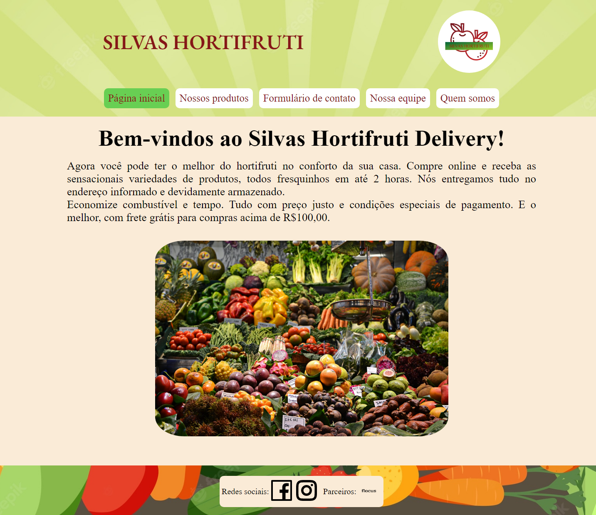

# Projeto 2 Resilia

>Módulo 1: Introdução ao front-end

Projeto em grupo ao qual foi proposto a construção de um website para uma loja ou empresa pequena de bairro.

Esse projeto teve como finalidade a aplicação das ferramentas aprendidas no primeiro módulo do curso.

[clique aqui para acessar](https://mcristhian.github.io/Projeto-2-Resilia/index.html)

## :hammer_and_wrench: Ferramentas utilizadas
- HTML
- CSS
- JavaScript
- Git e Github

## :mailbox: Contato
thematheuscris@gmail.com

davidgeosantos@gmail.com

thamaraevelyn2012@gmail.com

pireslima004@gmail.com

lucascardoso1302@gmail.com
